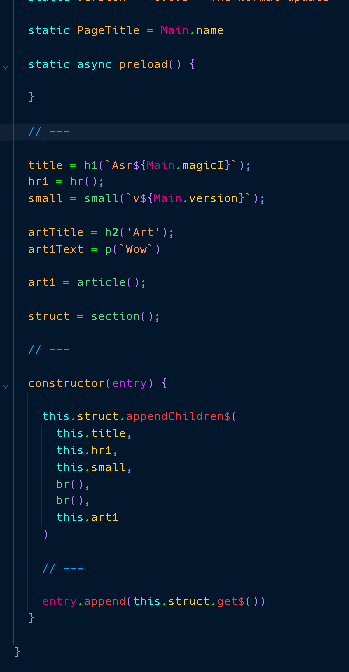
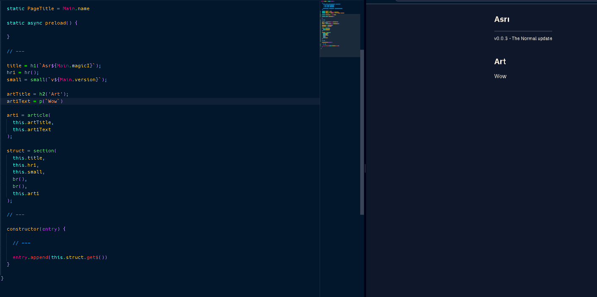

# Susha 101 - Why Susha is Good

When we use Susha, we can use tags to wrap our elements in the SushaWrapper.

This image displays a baisc implementation of adding elemnents in Susha in a more old-School way.

It uses the constructor to handle building the elements.

But wait!

Susha allows for a more simplistic aproach as well, oustide of the constructor!

Just with a few changes, your code becomes more readable, and grouped together.

And that's what Susha is about, future-sense code.